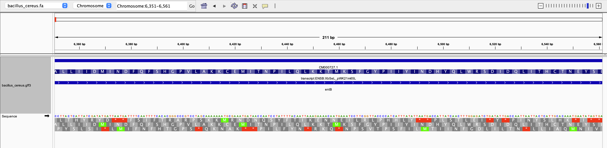
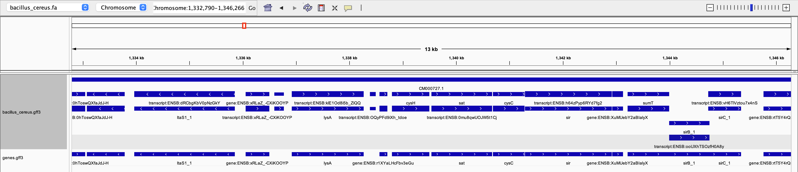
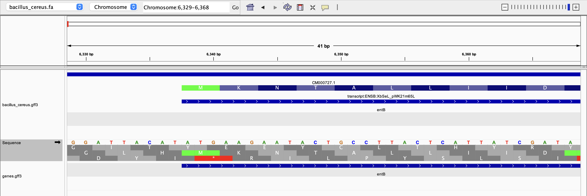

### Download data
```bash
wget https://ftp.ensemblgenomes.ebi.ac.uk/pub/bacteria/current/fasta/bacteria_10_collection/bacillus_cereus_95_8201_gca_000161135/dna/Bacillus_cereus_95_8201_gca_000161135.ASM16113v1_.dna.toplevel.fa.gz
wget https://ftp.ensemblgenomes.ebi.ac.uk/pub/bacteria/current/gff3/bacteria_10_collection/bacillus_cereus_95_8201_gca_000161135/Bacillus_cereus_95_8201_gca_000161135.ASM16113v1.62.gff3.gz
```

### Extract and rename
```bash
gunzip Bacillus_cereus_95_8201_gca_000161135.ASM16113v1_.dna.toplevel.fa.gz
mv Bacillus_cereus_95_8201_gca_000161135.ASM16113v1_.dna.toplevel.fa bacillus_cereus.fa
gunzip Bacillus_cereus_95_8201_gca_000161135.ASM16113v1.62.gff3.gz
mv Bacillus_cereus_95_8201_gca_000161135.ASM16113v1.62.gff3 bacillus_cereus.gff3
```

### Use IGV to visualize your genome and the annotations relative to the genome.

---

---

### How big is the genome, and how many features of each type does the GFF file contain?
```bash
seqkit stats bacillus_cereus.fa
    bacillus_cereus.fa  FASTA   DNA          1  5,584,055  5,584,055  5,584,055  5,584,055
```
```bash
grep -v "^#" bacillus_cereus.gff3 | cut -f3 | sort | uniq -c | sort -rn
    5798 exon
    5677 mRNA
    5677 gene
    5677 CDS
    121 ncRNA_gene
    121 ncRNA
    1 region
```
```bash
grep -v "^#" bacillus_cereus.gff3 | cut -f3 | sort | uniq -c | sort -rn | wc -l
    7
```

### From your GFF file, separate the intervals of type "gene" or "transcript" into a different file. Show the commands you used to do this.
```bash
awk '$3 == "gene"' bacillus_cereus.gff3 > genes.gff3
```

### Visualize the simplified GFF in IGV as a separate track. Compare the visualization of the original GFF with the simplified GFF.

---

---

### Zoom in to see the sequences, expand the view to show the translation table in IGV. Note how the translation table needs to be displayed in the correct orientation for it to make sense.

---

---


### Visually verify that the first coding sequence of a gene starts with a start codon and that the last coding sequence of a gene ends with a stop codon.
Done