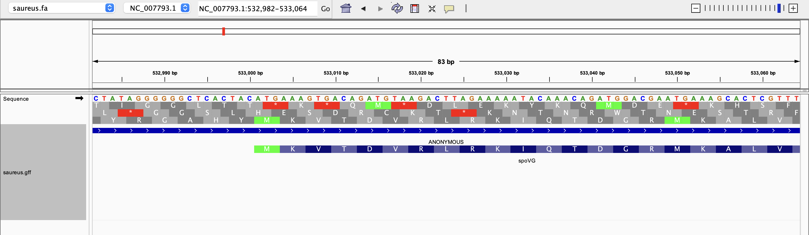
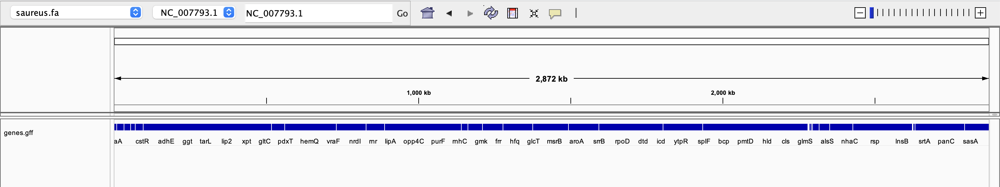

# Data retrieval:

### Identify the accession numbers for the genome referenced in your assigned paper.
```text
NC_007793.1
```
### Write shell commands to download the genome and annotation data. Ensure your commands are reusable and reproducible.
```bash
efetch -db nuccore -id NC_007793.1 -format fasta > saureus.gff
```
```bash
efetch -db nuccore -id NC_007793.1 -format gff3 > saureus.gff
```
```bash
efetch -db nuccore -id NC_007793.1 -format gbwithparts -mode text > saureus.gbk
```
# Visualization:

### Use IGV to visualize the genome and its annotations (e.g., GFF file) relative to the genome sequence.

---

---

# Data evaluation:

### Determine the genome size and count the number of features of each type in the GFF file.
```bash
seqkit stats saureus.fa
```
```text
file        format  type  num_seqs    sum_len    min_len    avg_len    max_len
saureus.fa  FASTA   DNA          1  2,872,769  2,872,769  2,872,769  2,872,769
```
```bash
grep -v "^#" saureus.gff | cut -f3 | sort | uniq -c | sort -rn
```
```text
2813 CDS
2801 gene
  82 pseudogene
  72 exon
  52 tRNA
  16 rRNA
  13 riboswitch
   3 sequence_feature
   3 binding_site
   1 tmRNA
   1 SRP_RNA
   1 RNase_P_RNA
   1 region
   1 ncRNA
```
```bash
grep -v "^#" saureus.gff | cut -f3 | sort | uniq -c | wc -l
```
```text
14
```
### Identify the longest gene. What is its name and function? (You may need to search external resources.)
```bash
awk -F'\t' '$3 == "gene" {print $5 - $4 + 1, $9}' saureus.gff | sort -nr | head -n 1
```
```text
31266 ID=gene-SAUSA300_RS07235;Name=ebh;gbkey=Gene;gene=ebh;gene_biotype=protein_coding;locus_tag=SAUSA300_RS07235;old_locus_tag=SAUSA300_1327
```
```text
ebh - hyperosmolarity resistance protein Ebh
https://pubmed.ncbi.nlm.nih.gov/18639517/
```
### Pick another gene, and describe its name and function.
```bash
awk -F'\t' '$3 == "gene" {print $5 - $4 + 1, $9}' saureus.gff | sort -nr | head -n 2 | tail -n 1
```
```text
7176 ID=gene-SAUSA300_RS00950;Name=ausA;gbkey=Gene;gene=ausA;gene_biotype=protein_coding;locus_tag=SAUSA300_RS00950;old_locus_tag=SAUSA300_0181
```
```text
AusA - Dimodular Nonribosomal Peptide Synthetase
https://pmc.ncbi.nlm.nih.gov/articles/PMC3577359/
```
### Examine the distribution of genomic features: Are they closely packed or is there significant intergenic space?

---

---

```text
No significant intergenic space
```
### Using IGV, estimate what proportion of the genome is covered by coding sequences.
```text
The approximate proportion is around 85-90%. Prokaryotes usually dont have the "luxury" of junk DNA.
```

# Alternative genome builds:

### Find alternative genome builds for your organism (include their accession numbers).
```text
GCA_001049575.1
```
```bash
wget https://ftp.ensemblgenomes.ebi.ac.uk/pub/bacteria/release-62/fasta/bacteria_2_collection/staphylococcus_aureus_gca_001049575/dna/
```
### Briefly discuss what different questions could be answered using a different genome build, considering the focus of your assigned paper.
```bash
seqkit stats GCA_001049575.1.fasta
```
```text
file                   format  type  num_seqs    sum_len  min_len   avg_len  max_len
GCA_001049575.1.fasta  FASTA   DNA         68  2,921,201      525  42,958.8  454,868
```