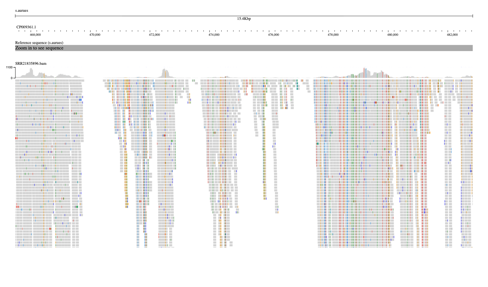

# This assignment involves creating a Makefile and a Markdown report. Submit the link to your GitHub repository.

Start with the script from your previous assignment that asked you write a bash script to download the genome and sequencing reads from SRA.

### Transform the script into a Makefile that includes rules for:
Obtaining the genome
```bash
bio fetch --format fasta CP009361 > ref.fa
```
```bash
seqkit stats ref.fa
```
```text
file    format  type  num_seqs    sum_len    min_len    avg_len    max_len
ref.fa  FASTA   DNA          1  2,778,854  2,778,854  2,778,854  2,778,854
```

Downloading sequencing reads from SRA
```bash
fasterq-dump SRR21835896 --split-files
```
```bash
seqkit stats SRR21835896_1.fastq SRR21835896_2.fastq
```
```text
file                 format  type    num_seqs        sum_len  min_len  avg_len  max_len
SRR21835896_1.fastq  FASTQ   DNA   15,754,542  1,591,208,742      101      101      101
SRR21835896_2.fastq  FASTQ   DNA   15,754,542  1,591,208,742      101      101      101
```

### Your README.md should explain the use of the Makefile in your project.

### Add the following targets to the Makefile:

index: Index the genome
align: Generate a sorted and indexed BAM file by aligning reads to the genome

### Visualize the resulting BAM files for both simulated reads and reads downloaded from SRA.
---



---

### Generate alignment statistics for the BAM file.

```bash
samtools flagstats SRR21835896.bam
```
```text
31590820 + 0 in total (QC-passed reads + QC-failed reads)
31509084 + 0 primary
0 + 0 secondary
81736 + 0 supplementary
0 + 0 duplicates
0 + 0 primary duplicates
30304609 + 0 mapped (95.93% : N/A)
30222873 + 0 primary mapped (95.92% : N/A)
31509084 + 0 paired in sequencing
15754542 + 0 read1
15754542 + 0 read2
29999760 + 0 properly paired (95.21% : N/A)
30117908 + 0 with itself and mate mapped
104965 + 0 singletons (0.33% : N/A)
0 + 0 with mate mapped to a different chr
0 + 0 with mate mapped to a different chr (mapQ>=5)
```

What percentage of reads aligned to the genome?
```text
95.92%
```
What was the expected average coverage?
What is the observed average coverage?
```bash
samtools coverage SRR21835896.bam
```
```text
#rname  startpos        endpos  numreads        covbases        coverage        meandepth       meanbaseq       meanmapq
CP009361.1      1       2778854 30304609        2362796 85.0277 989.744 36.2    59.6
```
```text
Expected Coverage = (total primary reads count x read length) / genome length
Expected Coverage = (15754542 x 2 x 101) / 2778854 = 1145.2
```
```text
Observed Coverage comes from samtools covarage command: 989.7
```
