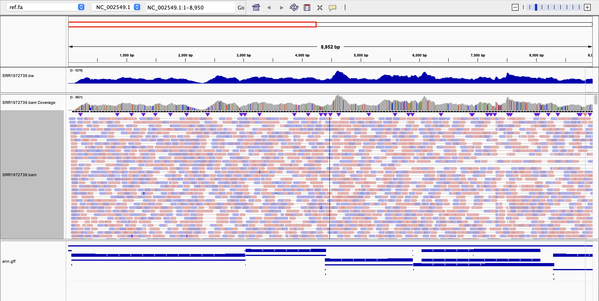

### Visualize the GFF annotations and both wiggle and BAM files in IGV.
---



---

### Briefly describe the differences between the alignment in both files.
```text
- BAM shows individual read alignments — you can see each read, its sequence, mapping quality, strand, etc.
- BW (BigWig) shows a summarized coverage signal (depth per position) — no individual read detail, but renders instantly over large
  regions and is ideal for spotting coverage patterns across the whole genome.
```

### Briefly compare the statistics for the BAM file.
```bash
samtools flagstat SRR1972739.bam
```
```text
1553844 + 0 in total (QC-passed reads + QC-failed reads)
1516674 + 0 primary
0 + 0 secondary
37170 + 0 supplementary
0 + 0 duplicates
0 + 0 primary duplicates
803612 + 0 mapped (51.72% : N/A)
766442 + 0 primary mapped (50.53% : N/A)
1516674 + 0 paired in sequencing
758337 + 0 read1
758337 + 0 read2
717768 + 0 properly paired (47.33% : N/A)
725094 + 0 with itself and mate mapped
41348 + 0 singletons (2.73% : N/A)
0 + 0 with mate mapped to a different chr
0 + 0 with mate mapped to a different chr (mapQ>=5)
```

### How many primary alignments does the BAM file contain?
```text
1516674
```
### What coordinate has the largest observed coverage? (hint: samtools depth)
```bash
samtools depth SRR1972739.bam | sort -k3nr | head -n 5
```
```text
NC_002549.1     4609    9601
NC_002549.1     4623    9558
NC_002549.1     4608    9521
NC_002549.1     4606    9507
NC_002549.1     4607    9498
```
```text
Position 4609 on NC_002549.1 has the highest coverage with a depth of 9601 reads.
```
### Select a gene of interest. How many alignments on the forward strand cover the gene?
```bash
awk '$3 == "gene"' ann.gff
```
```text
NC_002549.1     RefSeq  gene    56      3026    .       +       .       ID=gene-ZEBOVgp1;Dbxref=GeneID:911830;Name=NP;gbkey=Gene;gene=NP;gene_biotype=protein_coding;locus_tag=ZEBOVgp1
NC_002549.1     RefSeq  gene    3032    4407    .       +       .       ID=gene-ZEBOVgp2;Dbxref=GeneID:911827;Name=VP35;gbkey=Gene;gene=VP35;gene_biotype=protein_coding;locus_tag=ZEBOVgp2
NC_002549.1     RefSeq  gene    4390    5894    .       +       .       ID=gene-ZEBOVgp3;Dbxref=GeneID:911825;Name=VP40;gbkey=Gene;gene=VP40;gene_biotype=protein_coding;locus_tag=ZEBOVgp3
NC_002549.1     RefSeq  gene    5900    8305    .       +       .       ID=gene-ZEBOVgp4;Dbxref=GeneID:911829;Name=GP;gbkey=Gene;gene=GP;gene_biotype=protein_coding;locus_tag=ZEBOVgp4
NC_002549.1     RefSeq  gene    8288    9740    .       +       .       ID=gene-ZEBOVgp5;Dbxref=GeneID:911826;Name=VP30;gbkey=Gene;gene=VP30;gene_biotype=protein_coding;locus_tag=ZEBOVgp5
NC_002549.1     RefSeq  gene    9885    11518   .       +       .       ID=gene-ZEBOVgp6;Dbxref=GeneID:911828;Name=VP24;Note=putative;gbkey=Gene;gene=VP24;gene_biotype=protein_coding;locus_tag=ZEBOVgp6
NC_002549.1     RefSeq  gene    11501   18282   .       +       .       ID=gene-ZEBOVgp7;Dbxref=GeneID:911824;Name=L;gbkey=Gene;gene=L;gene_biotype=protein_coding;locus_tag=ZEBOVgp7
```
```bash
samtools view -F 16 SRR1972739.bam NC_002549.1:56-3026 | wc -l
```
```text
72501
```